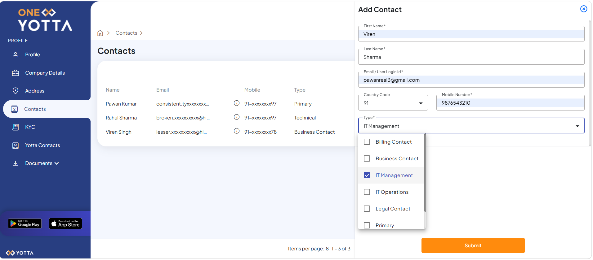
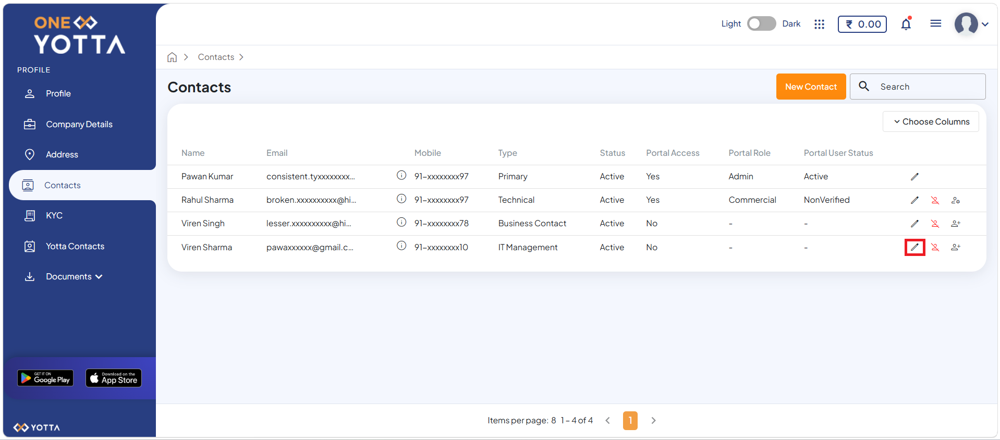
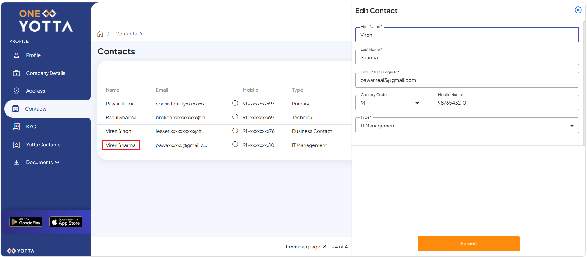
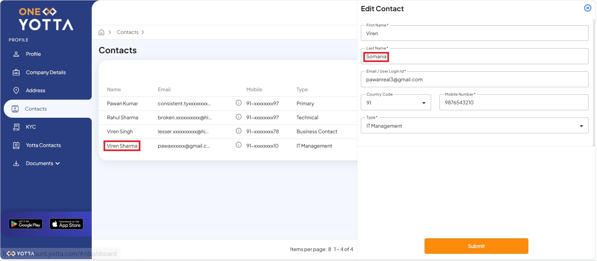
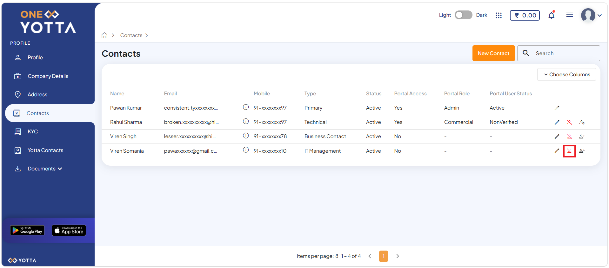

# Team Member and Child User Management

The **Contacts** section in the Account Centre allows organisations to manage team members or child user efficiently. Users can add Admin, Commercial, and Technology roles to grant appropriate access permissions, enabling team members to log in and perform role-specific operational and management activities.

To add a team member or child user, perform the following steps: 

1. Click the User Account ID (for example, **YNT-E433**), and click **Account**. The following screen appears:
 
2. Click the **Teams** tab in the Account section. The following screen appears:

3. Click the **+ Invite Team Member** button. The portal redirects you to the OneYotta platform and automatically opens the Contacts tab under the Profile section. The following screen appears:

4. Click the **New Contact** button. The following screen appears where you must enter the required details:

   
    - First Name
    - Last Name
    - Email
    - Country Code
    - Mobile Number
    - Type
5. Click the **Submit** button. The following screen appears:
 
   
   Once you add the team member, the portal automatically sends a registration confirmation email to the member's registered email address.
   

6. Click the **Edit** icon. The following screen appears where you can review and update the details provided during the team member registration process.
 
   The following screen displays the changes you are making.
 

7. Click the **Submit** button. The following screen appears:

8. Click the **Contact Deactivate** icon. The following screen appears: 
   
   
   
