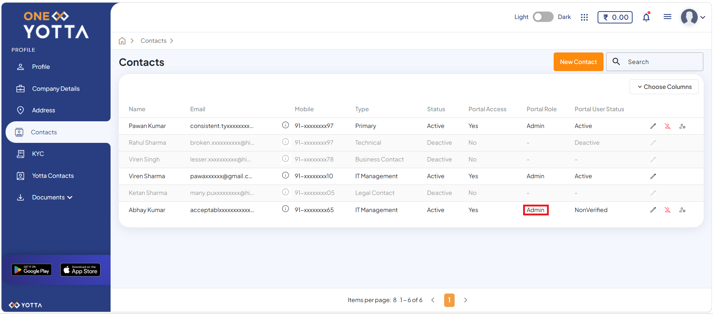

# Team Member or Child User Management

The Role-Based Access Control (RBAC) in the One Yotta portal is a security framework that manages team member or child user access based on defined roles such as Admin, Commercial, and Technology. It is required to ensure that you have appropriate and restricted access to only the functions relevant to their responsibilities, improving security and operational efficiency. 

To add a team member or child user, perform the following steps:
1. Navigate to [Yntraa Cloud url](https://portal.yntraacloud.ai/). The following screen appears where you must provide the required details.
   
   
     - **Email**
     - **Password**
2. Click the **Sign In** button. The following screen appears: 
   
3. Click the **User Account ID** (for example, YNT-E433) and then click **Account** from the menu on the top-right corner. The following screen appears:
 
4. Navigate **Account >Team**. The following screen appears:

5. Click the **+ Invite Team Members** button. The portal redirects you to the One Yotta platform and automatically opens the Contacts tab as shown in the screen.

6. Click the **New Contact** button. The following screen appears where you must provide the required details.

   
    - **First Name**
    - **Last Name**
    - **Email**
    - **Country Code**
    - **Mobile Number**
    - **Type** (The Type field lets you assign multiple roles to a contact based on their responsibilities within the organization)
7. Click the **Submit** button. The following screen appears:
 
   
:::note
Once a team member or child user is added, a registration confirmation email is sent to their registered email address, allowing them to set their password and sign in to the One Yotta platform.
:::

8. Click the **Add as Portal User** icon. The following screen appears:
   
9. Select the role **Admin User** from the list. The following screen appears:
   
    - **Admin** - Full access to all functionalities. 
    - **Commercial** - Gets permission to perform billing actions and read-only for other actions.
    - **Technology** - Gets permission to perform technical actions and read-only for other actions. 
   
   
10. Click the **Yes** button. The system assigns the selected role to the team member or child user. The following screen appears:
   
   

   
   
   
