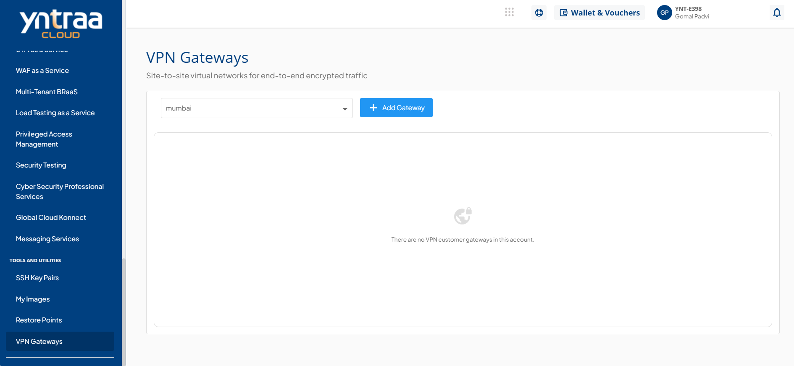
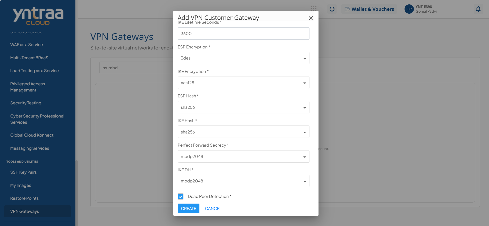
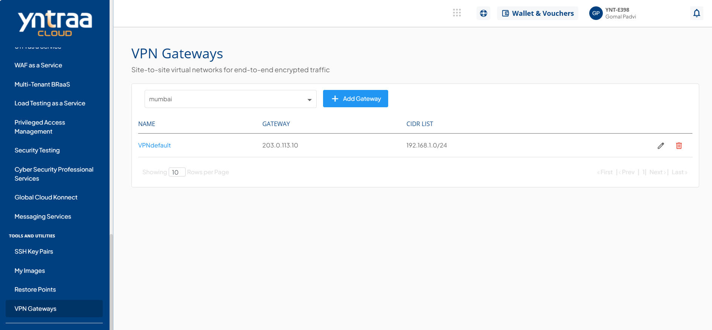

# Adding VPN Gateways

VPN Gateways allow you to establish secure connections between networks and cloud resources. The Yntraa Cloud Console enables you to create and manage VPN Gateways to ensure safe and reliable communication using encrypted tunnels over the internet. 

To add VPN Gateways, the following steps to configure and create a new VPN Gateway:

1. Navigate to **Tools and Utilities > VPN Gateways**.
   
2. Click the **+ Add Gateway** button. Then, enter the following required details displayed on the screen to add a VPN Customer Gateway:
   
3. Select the **Dead Peer Detection** option.
4. Click the **CREATE** button to add a VPN Customer Gateway.
   

