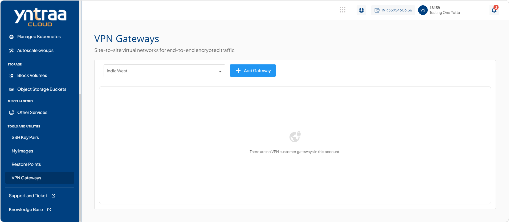
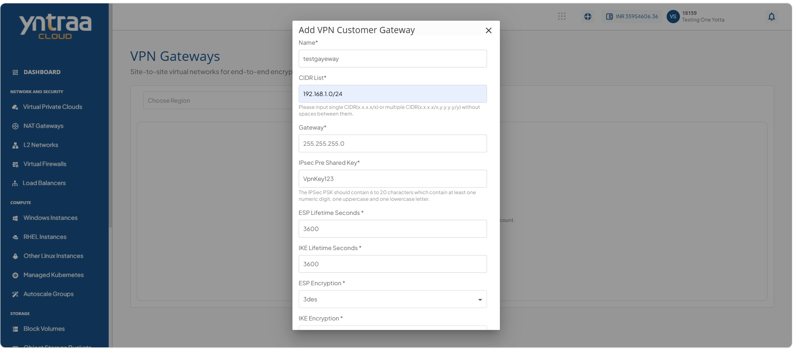
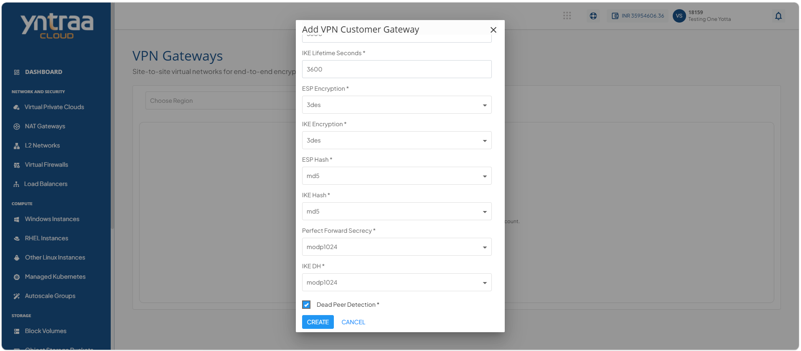
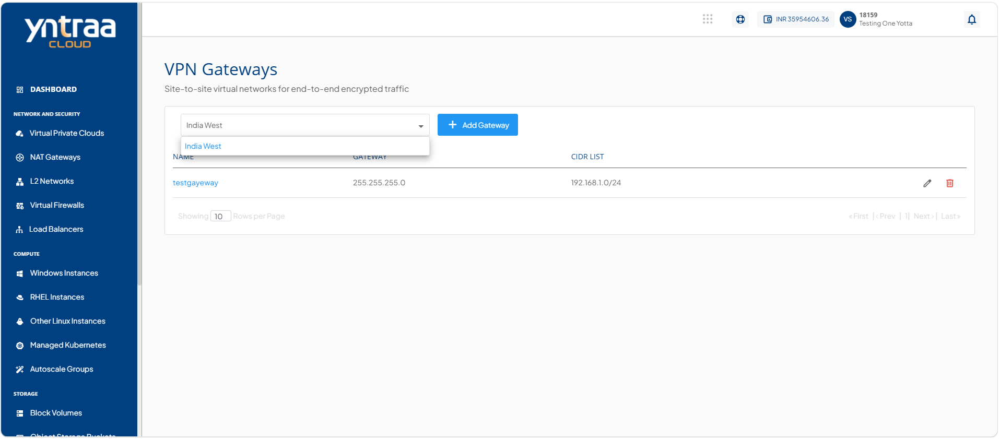

# Adding VPN Gateways

VPN Gateways allow you to establish secure connections between networks and cloud resources. The Yntraa Cloud Console enables you to create and manage VPN Gateways to ensure safe and reliable communication using encrypted tunnels over the internet. 

To add a VPN Gateway, follow these steps:

1. Navigate to **Tools and Utilities > VPN Gateways**. The following screen appears: 
   
2. Select availability zone from the dropdown.
3. Click the **+ Add Gateway** button. The following screen appears: 
  
    
4. Select the **Dead Peer Detection** option.
5. Click the **Create** button. The following screen appears: 
   

