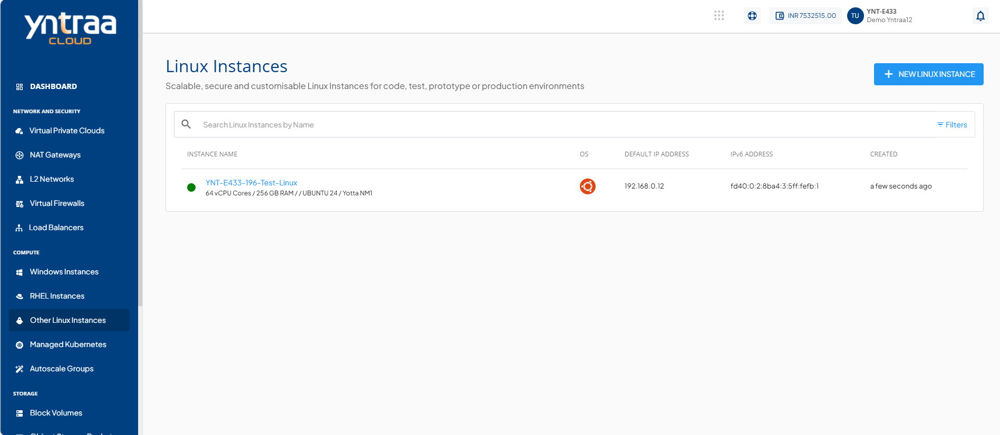
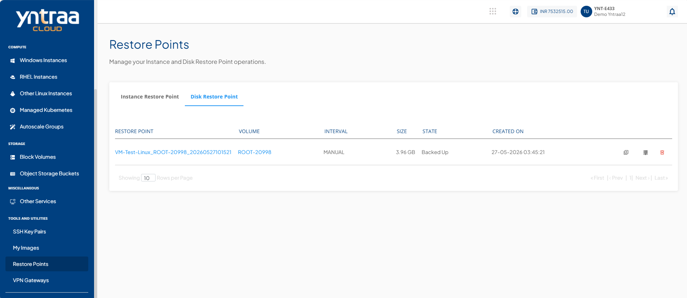
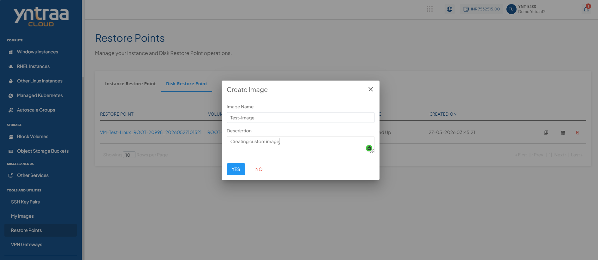
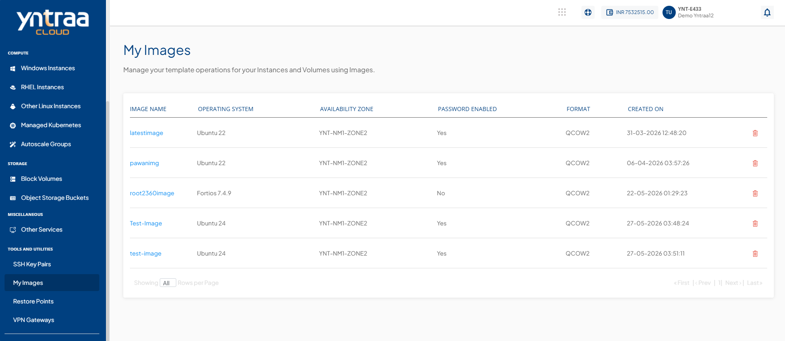
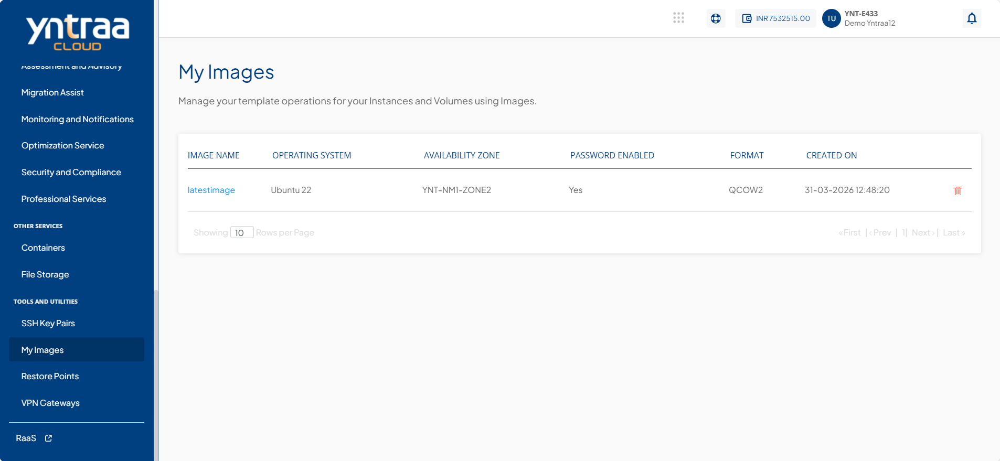
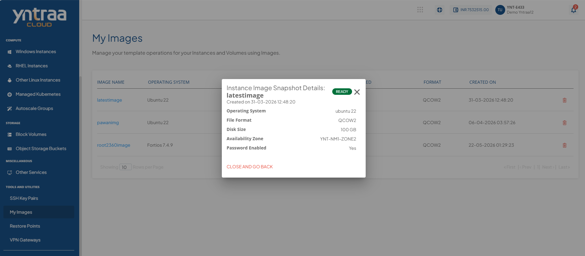
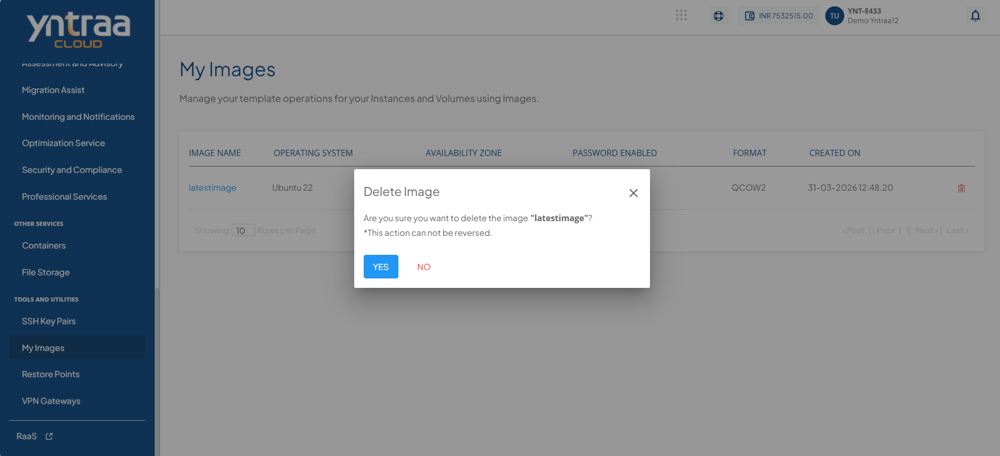

# Managing Custom Templates and Images

Managing custom templates and images helps you create and maintain reusable system configurations for future deployments. You can create custom images from existing instances, view image details, and remove unused images to keep resources organised and easy to manage.

The following sections describe how to create, view, and delete custom images:
- [Creating Custom Images](#creating-custom-images)
- [Viewing Custom Images](#viewing-custom-images)
- [Deleting Custom Images](#deleting-custom-images)

## Creating Custom Images

Creating custom images allows you to create a reusable image from an existing instance by using a disk restore point. The custom image captures the current state and configuration of the instance, making it easier to deploy new instances with the same setup.

To create custom images, follow these steps:

1. Navigate to **Compute > Other Linux Instances**. The following screen appears: 
2. Click an instance under **Other Linux Instances**.
3. Click **Volumes** to view the attached volumes or data disks.
4. Click the **CREATE RESTORE POINT** icon to create a restore point for the selected volume.
5. Navigate to **TOOLS AND UTILITIES > Restore Points**. 
6. Navigate to **Disk Restore Point** to view the newly created restore point. The following screen appears: 
7. Click the **Create Image** icon for the newly created **Disk Restore Point**. The following screen appears where you enter the following details:
    - **Image Name**
    - **Description**
   
     
1. Click **Yes** to confirm and create the image.
2. Navigate to **Tools and Utilities > My Images** to view the newly created custom image.
   

## Viewing Custom Images

Viewing custom images allows you to access and review the available custom images in the portal. You can open an image to view its details and verify the required information.

To view custom images, follow these steps: 
1. Navigate to **Tools and Utilities > My Images**. The following screen appears: 
2. Click the image name (for example, **latestimage**) under the **Image Name** column. The following screen appears:  

## Deleting Custom Images

Deleting custom images allows you to remove custom images that are no longer required. This helps keep the image repository organised and ensures that only relevant images are available for future use.

To delete custom images, follow these steps: 
1. Navigate to **Tools and Utilities > My Images**. The following screen appears: 
2. Click the **Delete** icon. The following screen appears: 
3. Click the **Yes** button to confirm.
