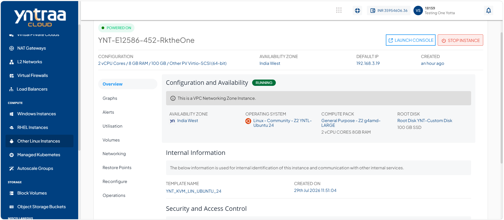
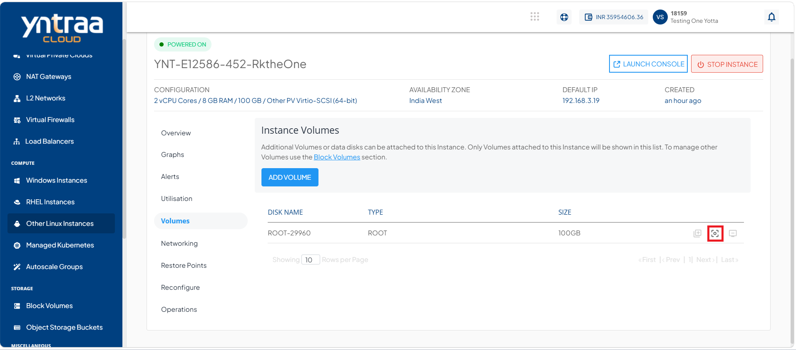
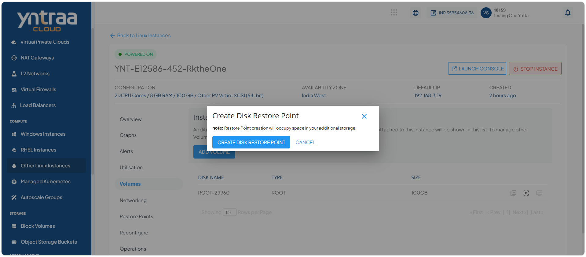
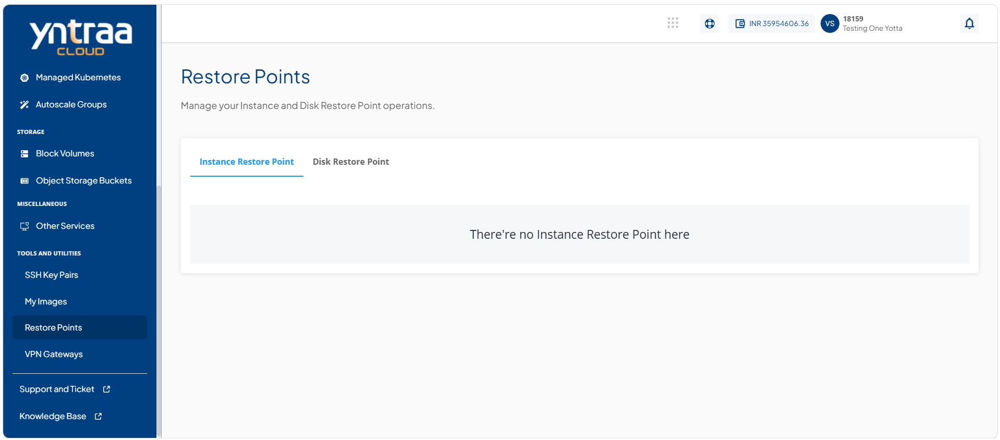
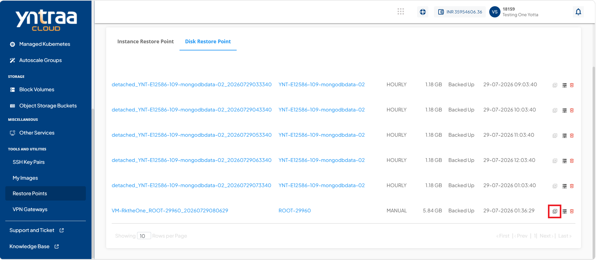
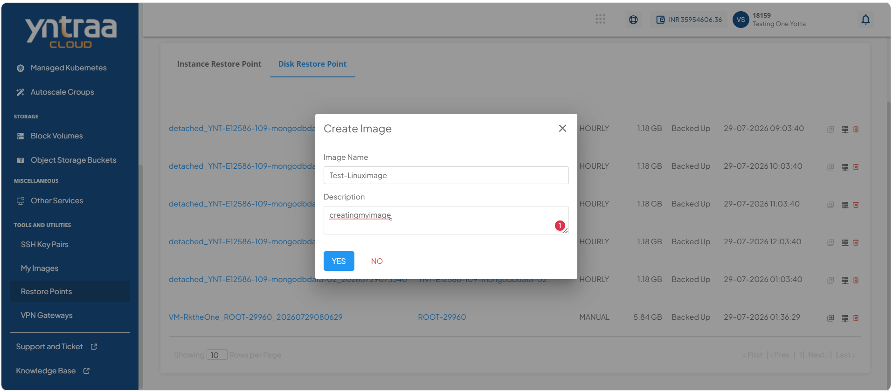
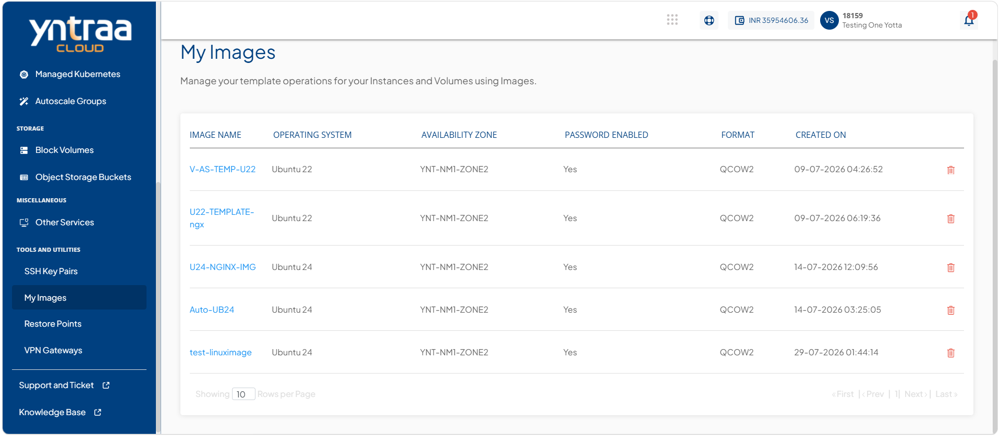
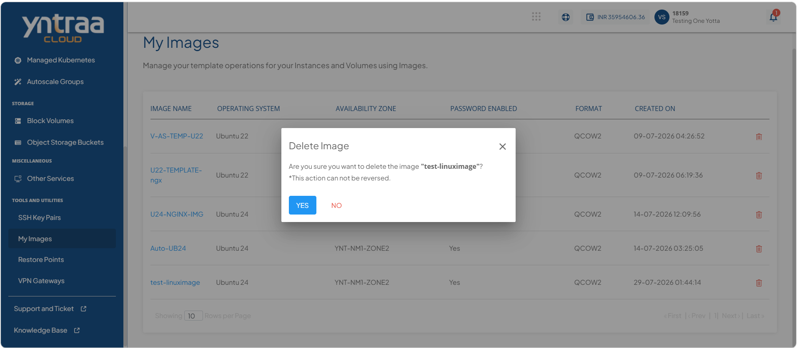

# Managing Custom Templates and Images

Custom templates and images help standardize and simplify the deployment of cloud resources. You can create custom images from existing instances for future reuse and delete custom images that are no longer required. Managing custom templates and images enables consistent deployments while keeping your image repository organized and up to date.

This section comprises of the following sub-sections:

 
- [Creating a Custom Image or My Image](#creating-a-custom-image-or-my-image)
- [ Deleting a Custom Image or My Image](#deleting-a-custom-image-or-my-image)

## Creating a Custom Image or My Image

Creating custom images or My Image allows you to create a reusable image from an existing instance by using a disk restore point. The custom image captures the current state and configuration of the instance, making it easier to deploy new instances with the same setup.

To create a custom image or My Image, follow these steps:

1. Navigate to **Compute > Other Linux Instances**. The following screen appears: 
   
2. Click on your created linux instance name from the list. The following screen appears:
   
3. Click **Volumes**. The following screen appears: 
   
4. Click the **Create Restore Point** icon (highlighted in red). The following screen appears: 
   
5. Click the **Create Restore Point**. The disk restore point is created. 
6. Navigate to **Tools and Utilities > Restore Points**. The following screen appears: 
   
7. Click **Disk Restore Point**. The following screen appears: 
   
8. Navigate to **Disk Restore Point**. The following screen appears: 
   
9. Click the **Create Image** icon (highlighted in red). The following screen appears where you provide the required details:
   
10. Click the **Yes** button.
11. Navigate to **Tools and Utilities > My Images**. The following screen appears: 
   

## Deleting a Custom Image or My Image

Deleting custom images or My Image allows you to remove custom images that are no longer required. This helps keep the image repository organised and ensures that only relevant images are available for future use.

To delete a custom image or My Image, follow these steps: 

1. Navigate to **Tools and Utilities > My Images**. The following screen appears: 
   
2. Click the **Delete** icon. The following screen appears: 
   
3. Click the **Yes** button. The custom image or My Image is deleted.
