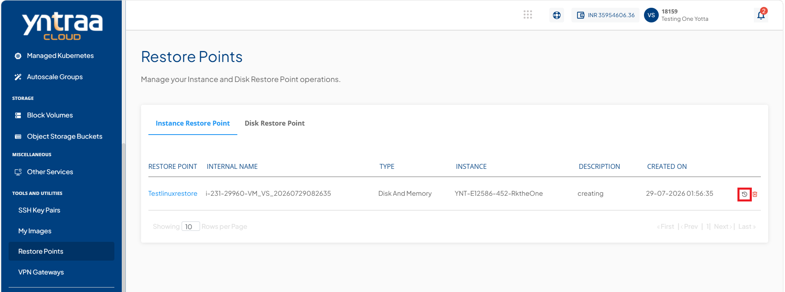
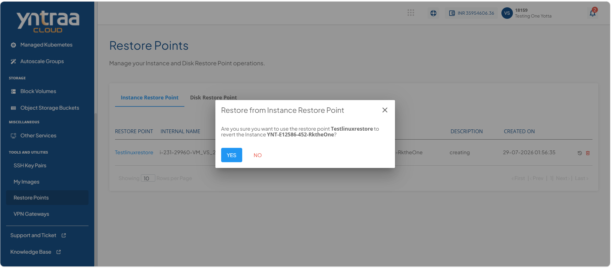
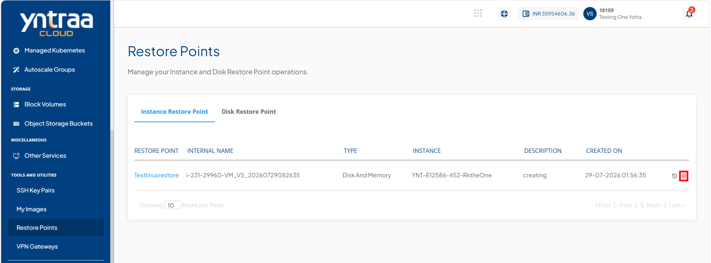
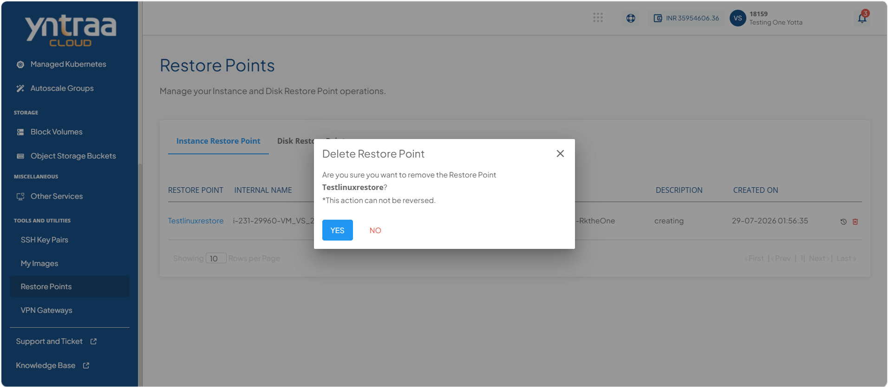
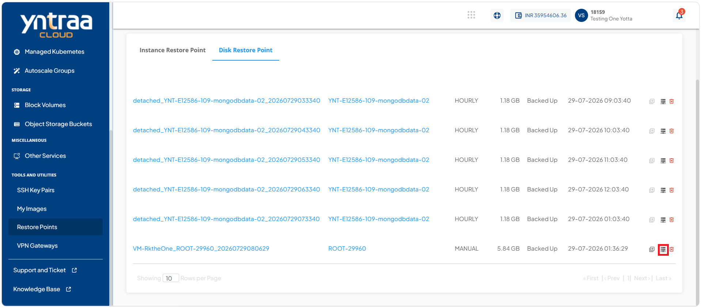

# Managing Instance and Disk Restore Points

Instance and disk restore points provide a reliable way to recover workloads and storage resources when required. You can restore an instance to a previous state, create a new volume or image from a disk restore point, and delete disk restore points that are no longer needed. Managing restore points helps ensure data protection, simplifies recovery operations, and optimizes storage management.

This section comprises of the following sub-sections:

 
- [Restoring an Instance Restore Point](#restoring-an-instance-restore-point)
- [Deleting an Instance Restore Point](#deleting-an-instance-restore-point)
- [Creating Volume from Disk Restore Point](#creating-volume-from-disk-restore-point)
- [Deleting a Disk Restore Point](#deleting-a-disk-restore-point)

## Restoring an Instance Restore Point

Restoring an instance restore point enables you to recover an instance to a previously saved state. This helps restore the instance configuration and data after accidental changes, failures, or other issues, allowing you to quickly return the instance to a known working state.

To restore an instance restore point, following these steps:

1. Navigate to **Tools and Utilities**. The following screen appears: 
   
2. Click the **Restore from Instance Restore Point** icon (highlighted in red). The following screen appears: 
   
3. Click the **Yes** button. 

## Deleting an Instance Restore Point

Deleting an instance restore point permanently removes it from your cloud account and frees the associated storage resources. Delete a restore point only when it is no longer required for recovery purposes, as it cannot be restored once deleted.

To delete an instance restore point, following these steps: 
  
1. Navigate to **Tools and Utilities**. The following screen appears: 
   
2. Click the **Delete Restore Point** icon (highlighted in red). The following screen appears: 
   
3. Click the **Yes** button. 

## Creating Volume from Disk Restore Point

Create a volume to provision additional block storage for your cloud resources. Volumes provide persistent storage that can be attached to instances to expand storage capacity, host application data, or separate data from the operating system. Creating dedicated volumes improves storage flexibility, simplifies data management, and allows independent backup, restore, and lifecycle management without affecting the associated instance.

To create volume from disk restore point, follow these steps: 

1. Navigate to **Tools and Utilities > Restore Points**. The following screen appears: 
   
2. Click **Disk Restore Point**. The following screen appears: 
   
3. Click the [**Create Volume**](/docs/Subscribers/Compute/WindowsInstances/ManagingVolume#creating-volume-from-disk-restore-point) icon (highlighted in red) to initiate the create volume procedure.

## Deleting a Disk Restore Point

Deleting a disk restore point permanently removes it from your cloud account and releases the associated storage resources. Delete a restore point only when it is no longer needed for recovery, as it cannot be recovered after deletion.

To delete a disk restore point, [click here](/docs/Subscribers/Compute/OtherLinuxInstances/ManagingVolume#deleting-disk-restore-point).
