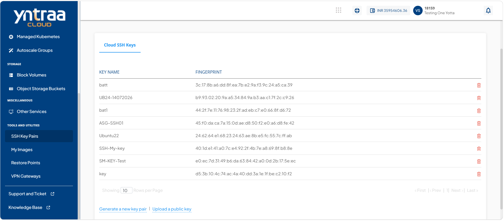
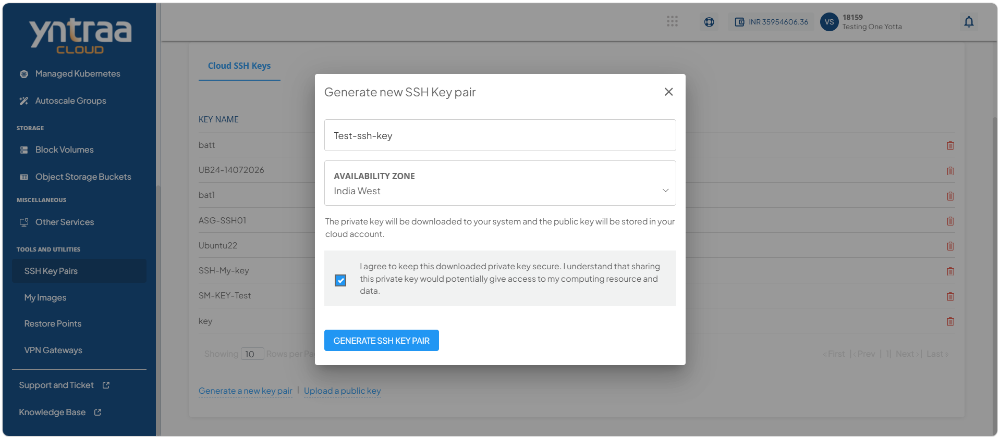
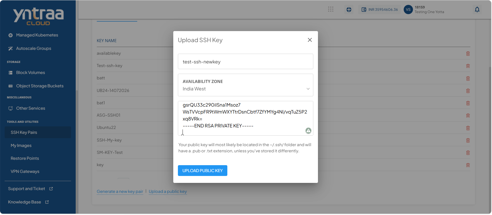
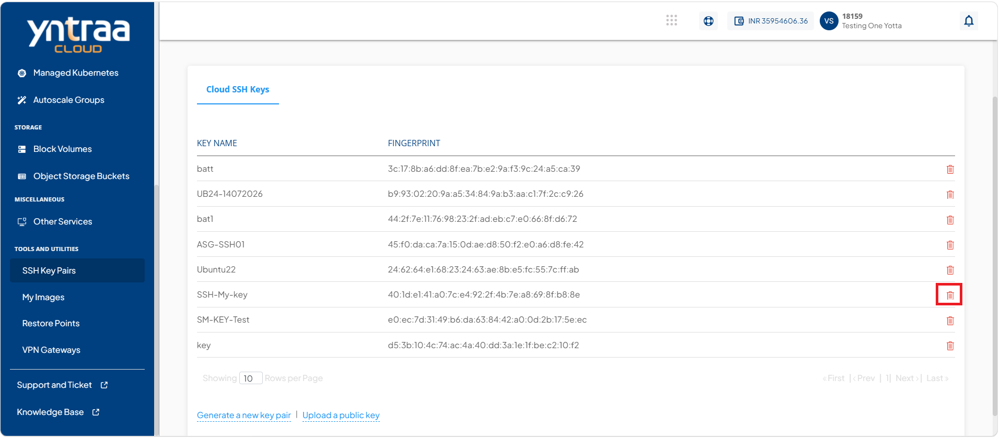
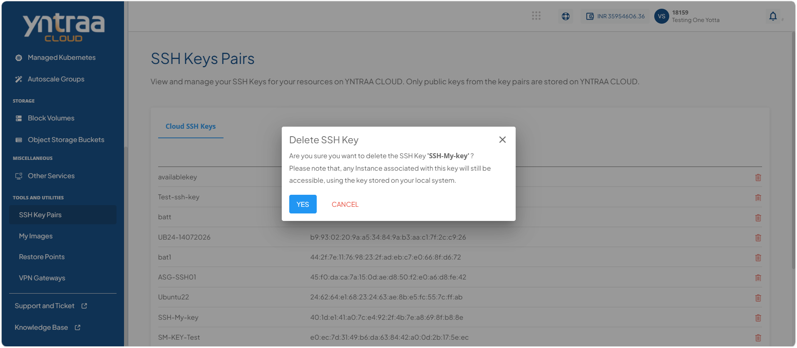

# Managing SSH Public Key Pair

SSH public key pairs enable secure, password-free authentication for accessing cloud instances. You can generate a new SSH key pair, upload an existing public key, or delete a public key that is no longer needed. Managing SSH public key pairs helps maintain secure access while ensuring that only authorized keys are available for instance authentication.

This section comprises of the following sub-sections:

  
- [Generating a SSH Public Key Pair](#generating-a-ssh-public-key-pair)
- [Uploading a SSH Public Key](#uploading-a-ssh-public-key)
- [Deleting a SSH Public key](#deleting-a-ssh-public-key)

## Generating a SSH Public Key Pair

SSH key pairs provide a secure and password-free method of authenticating access to cloud instances. A key pair consists of a **public key**, which is stored in your cloud account, and a **private key**, which is downloaded to your local system and used to establish secure SSH connections. Generating an SSH key pair helps protect your instances by using cryptographic authentication instead of passwords.

To generate a SSH key pair, follow these steps: 

1. Navigate to **Tools and Utilities > SSH Keys Pairs**. The following screen appears: 
   
2. Click **Generate a New Key Pair**. The following screen appears where you provide the required details: 
   
    - Enter name for SSH key pair in **Name Your SSH Key Pair**.
    - Select the required **Availability Zone** from the drop-down.
    - Select the **I agree to keep this downloaded private key secure. I understand that sharing this private key would potentially give access to my computing resource and data** option.
3. Click **Generate SSH Key Pair**. The SSH key pair is generated.

## Uploading a SSH Public Key

Uploading a public key allows you to use an existing SSH key pair to securely authenticate access to your cloud instances. Instead of generating a new key pair, you can upload the public key from an existing SSH key pair while keeping the corresponding private key on your local system. This is useful when you want to use the same SSH credentials across multiple instances or cloud environments.

To upload a public SSH key, follow these steps: 

1. Navigate to **Tools and Utilities > SSH Keys Pairs**. The following screen appears: 
    
2. Click **Upload a Public Key**. The following screen appears where you provide the required details:
   
3. Click the **Upload Public Key** button. 
   
## Deleting a SSH Public key

Deleting an SSH public key removes it from your cloud account, preventing it from being used to authenticate new SSH connections to instances. Delete a public key only if it is no longer required or has been replaced with a new key. Ensure that the associated private key is no longer in use before deleting the public key to avoid losing SSH access to instances that depend on it.

To delete a public SSH key, follow these steps: 

1. Navigate to **Tools and Utilities > SSH Keys Pairs**. The following screen appears: 
    
2. Click **Delete** icon (highlighted in red). The following screen appears:
    
3. Click the **Yes** button.   

