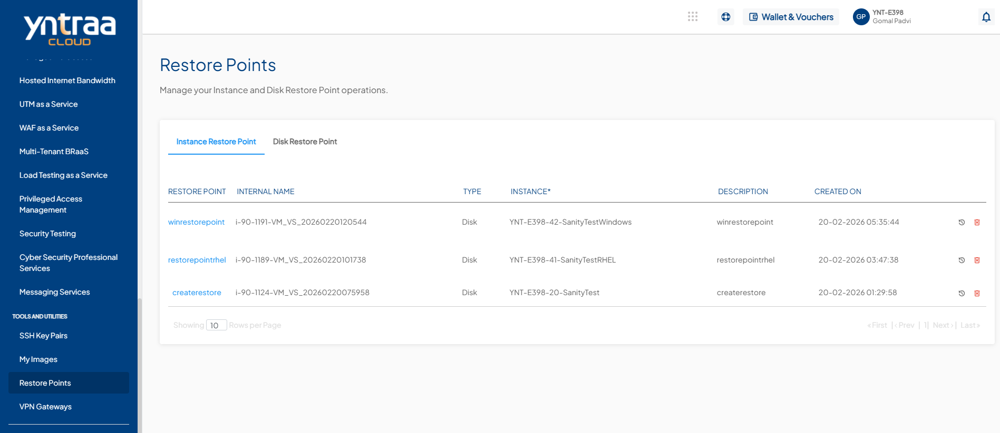
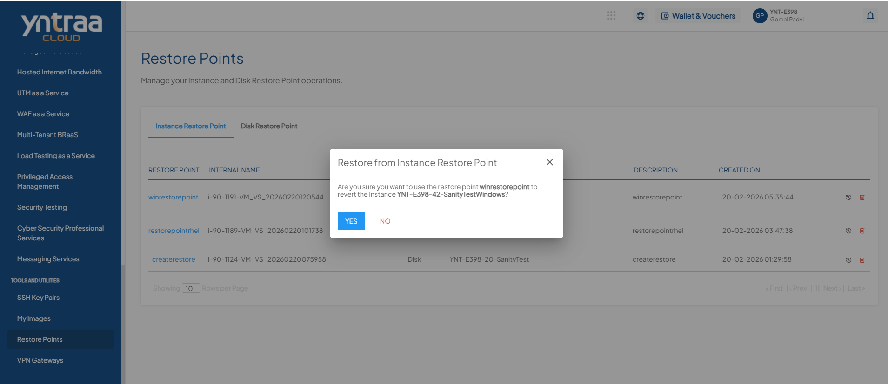
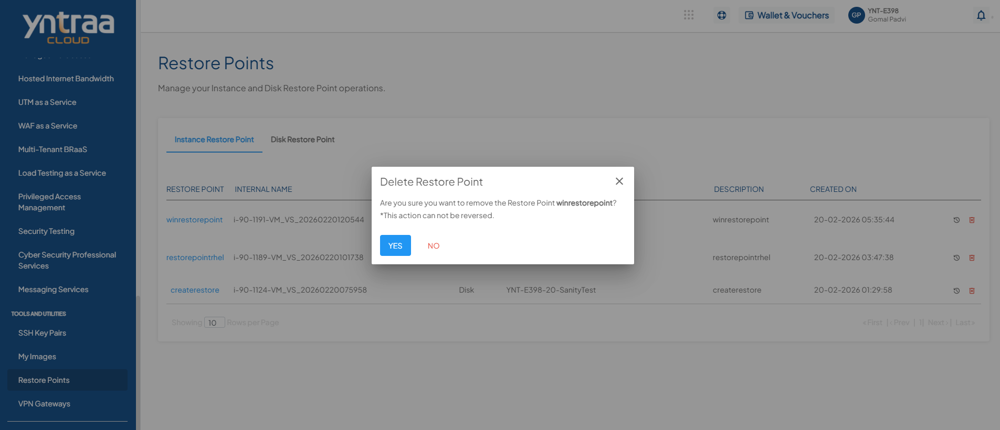
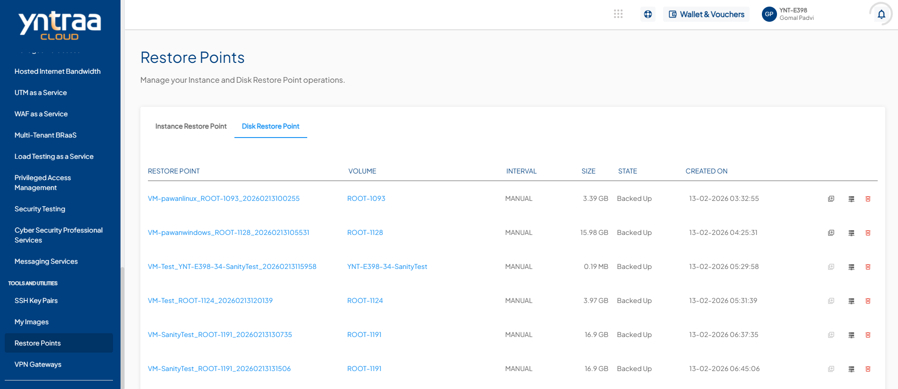

# Managing Instance and Volume Snapshots

Restore points use the [Yntraa Block Volumes](/docs/Subscribers/Storage/BlockVolumes/AboutBlockVolumes) service and occupy billable storage space.

You can view and manage all your instance restore points and disk restores points and perform various associated operations.

## Instance Restore Point

The instance snapshots tab lists the following details:

- RESTORE POINT
- INTERNAL NAME
- TYPE
- INSTANCE
- DESCRIPTION
- CREATED ON 
  
  To revert the Instance to the restore point, click the icon present in the right corner before the delete icon, or also you can click on the restore point name and then click the **REVERT INSTANCE** button. 

  To delete the Instance Snapshot, click the **delete** icon from the right corner. 
   
   
## Disk Restore Point

The volume snapshots section shows the following details:

- RESTORE POINT
- VOLUME
- INTERVAL
- SIZE
- STATE
- CREATED ON
  
  
