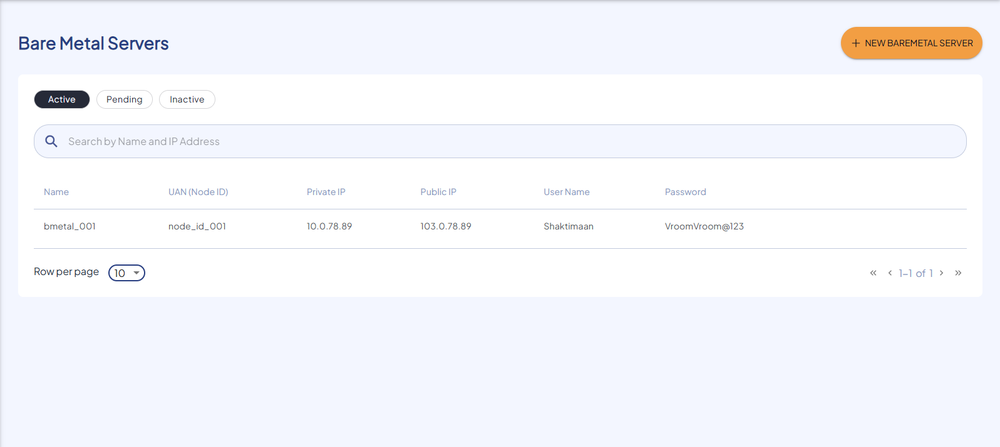
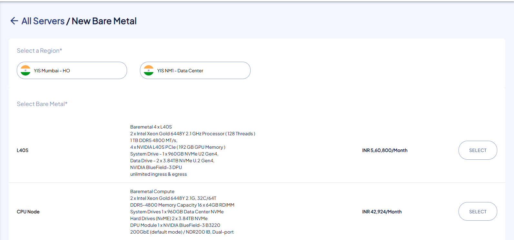
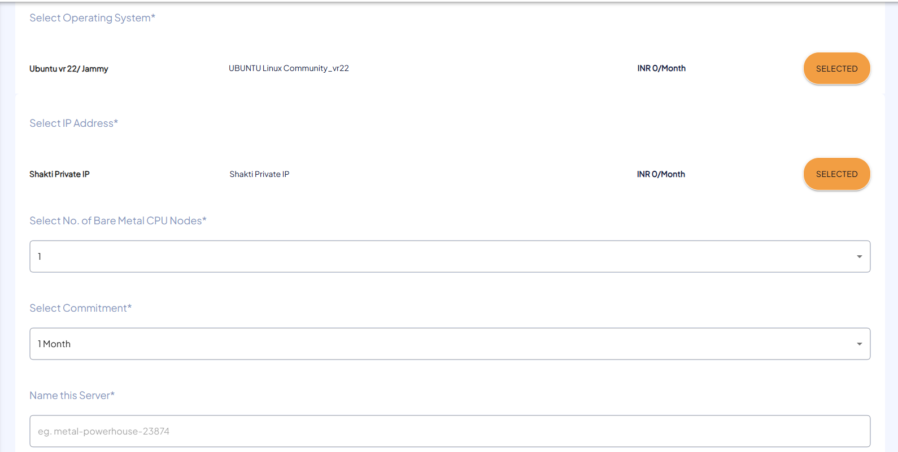
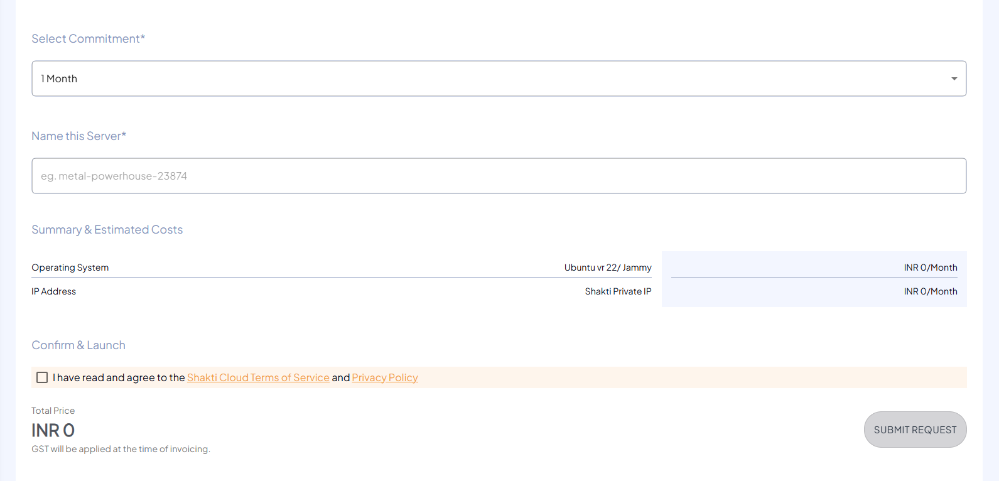

# Creating Bare Metal Server

The following are the steps to create Bare Metal:

1. To create new Bare Metal, click the **New Bare Metal** button.
   
2. Choose the geographical region.
3. Choose the Bare Metal type.
   
4. Select the Operating System.
5. Select an IP address.
6. Select the number of Bare Metal CPU Nodes.
7. Select Commitment.
8. Mention the unique and valid Name of your Bare Metal.
    
9. Verify the **Summary & Estimated Costs**.
10. Select the **I have read and agree to the Shakti Cloud Terms of Service** option.
11. Click **SUBMIT REQUEST**.
    
12. You get the following screen, click **CONFIRM** to Launch the resource.