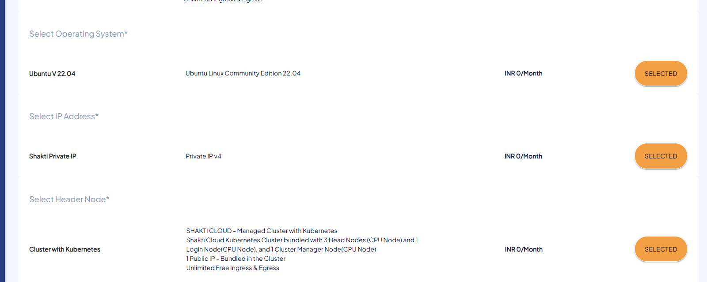
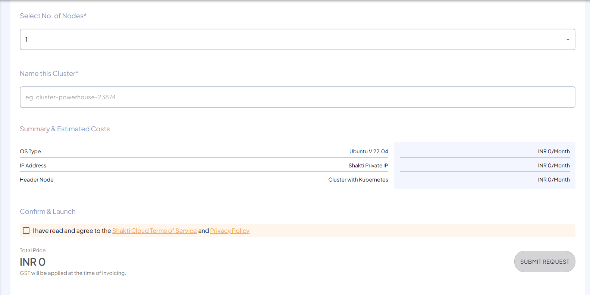

# Creating Kubernetes Cluster

The following are the steps to create Kubernetes Cluster:

1. To create new Kubernetes Cluster, click the **NEW KUBERNETES CLUSTER** button.
   
2. Choose the geographical region for the cluster.
3. Select the worker node type.
4. Choose the operating system for the nodes.
5. Assign an IP address.
6. Select the header node.
	 
7. Specify the number of nodes in the cluster.
8. Mention the unique and valid Name of your Kubernetes Cluster.
9. Verify the **Summary & Estimated Costs**.
10. Select the **I have read and agree to the Shakti Cloud Terms of Service** option.
11. Click **SUBMIT REQUEST**.
    
12. You get the following screen, click **CONFIRM** to Launch the resource.