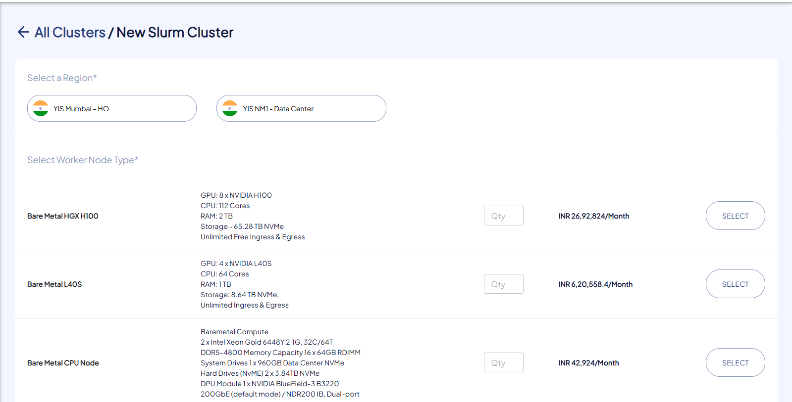
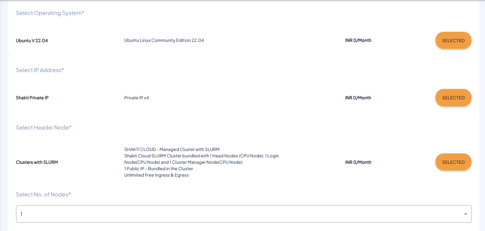
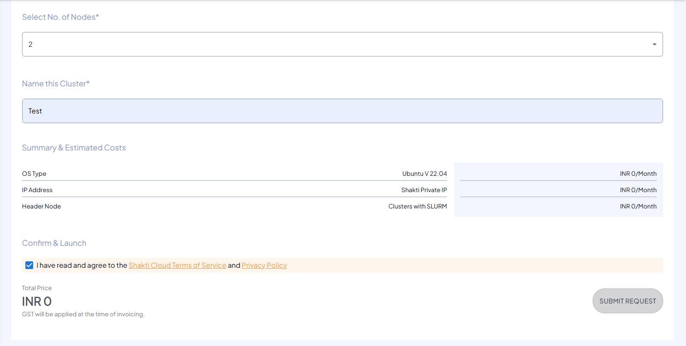

# Creating Slurm Cluster

The following are the steps to create Slurm Cluster:

1. To create new Slurm Cluster, click the **NEW SLURM CLUSTER** button.
2. Choose the geographical region for the cluster.
3. Select the worker node type for the Slurm cluster.
    
4. Choose the operating system for the nodes.
5. Assign a valid IP address to the cluster.
6. Select the header node.
7. Specify the number of nodes in the cluster.
   
8. Mention the unique and valid Name of your Slurm Cluster.
9. Verify the **Summary & Estimated Costs**.
10. Select the **I have read and agree to the Shakti Cloud Terms of Service** option.
11. Click **SUBMIT REQUEST**.
    
12. You get the following screen, click **CONFIRM** to Launch the resource.