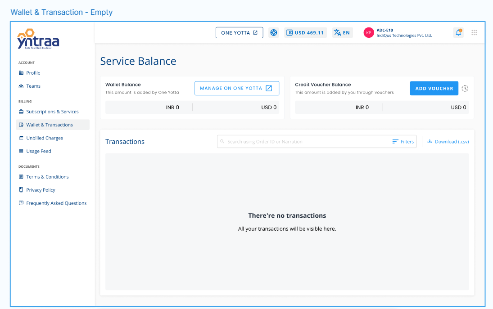

# Wallet and Transactions

The Wallet and Transactions section gives users a quick view of their account balance and transaction history. It shows available funds, including wallet and voucher balances, and offers basic tools to search, filter, and download transaction records. This section helps users keep track of their billing and payments in one place.
## Accessing Wallet & Transactions

The **Wallet & Transactions** section allows users to view their account balance and track all transaction activities. It provides an overview of wallet and voucher balances along with tools to search, filter, and export transaction history. This section helps users manage billing-related information with ease.

1. **Navigate to Wallet & Transactions**: From the left-hand menu under the **Billing** section, click on **Wallet & Transactions**.
2. **View Service Balance**: The **Service Balance** section displays two types of balances:
    - **Wallet Balance**: This amount is added by One Yotta. You can manage this balance by clicking the **Manage on One Yotta** button.
    - **Credit Voucher Balance**: This is the amount added by you through vouchers. You can add a new voucher using the **Add Voucher** button.
3. **Check Available Balance**: Both balances are shown in **INR** and **USD**. If no funds are available, the values will display as **INR 0** and **USD 0**.
4. **Review Transactions**: In the **Transactions** section below:
    - Use the **search bar** to filter transactions by **Order ID** or **Narration**.
    - Apply additional filters using the **Filters** button.
    - Export your transactions by clicking the **Download (.csv)** link.
    - If there are no transactions, a message saying **"There're no transactions"** will appear.
